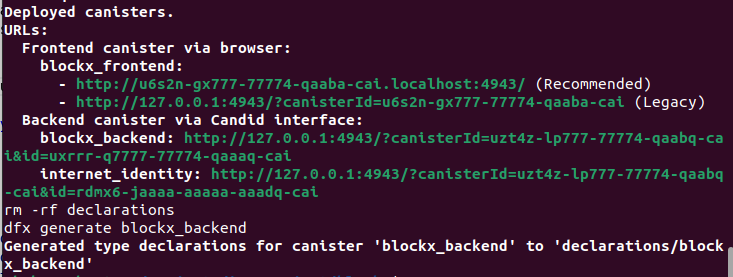
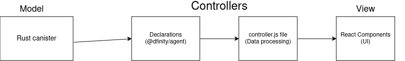

# Verisys (former blockx)

**Verisys** is a dApp for registering your ownership of all assets whether they are physical assets in the real world or non-physical assets like your ideas or anything digital on the **Internet Computer**.

**The Problem**:

We all have some important things to us and would like to have some sort of approval that they belong to us and to have the option of preventing others from using it or cliams their ownership of it

**The Solution**:

in Verisys, you can have that approval in a decenterlaized environment that provides transparency and prevnting the manipulation of your registerd assets

You will get a **document** that approves your assets ownership, anyone can **verify** that your assets are registerd, and nobody can register your asset ever again in the future.

## Get Starting

### Build and deploy

run `Make`

### Build with fresh data

run `Make fresh`

### Running the dApp

After running any of the previus commnds, you will see at the end of the output links like in the following image:



**Open the link associated with `blockx_frontend` to start using the dApp**

all other links are candid interfaces.

## Features
- Register physical and non physical assets
- Secure and easy login with **Internet Identity**
- Download your assets ownership approval certificates
- Secure files upload as they are not saved
- User-freindly UI/UX

## Architecture

The project is following the **MVC** software architectural pattern.

*Model*: Rust cansiter exposes its **API** through the controller

*View*: React components composing the **UI/UX**, and talks with the controller

*Controller*: The generated **declarations** `(@dfinity/agent)` and the extra layer in the `frontend/src/controller/controller.js` file that handles the data processing between the *model* and the *view*




## Directory Structure

### Root

```
├── backend
├── Cargo.lock
├── Cargo.toml
├── declarations
├── dfx.json
├── frontend
├── Makefile
├── public
├── README.md
└── rust-toolchain.toml
```

### Backend

```
├── Cargo.toml
└── src
    ├── asset.rs
    ├── blockx_rust.did
    ├── err.rs
    ├── hash.rs
    ├── lib.rs
    ├── store.rs
    └── utils.rs

```
### Frontend

```
├── dist
│   ├── android-chrome-192x192.png
│   ├── android-chrome-512x512.png
│   ├── apple-touch-icon.png
│   ├── assets
│   │   ├── index-B78hRfqR.js
│   │   ├── index-BfqK5uaz.css
│   │   ├── index-D8b4DHJx.css
│   │   └── index-DK-xQhXp.js
│   ├── favicon-16x16.png
│   ├── favicon-32x32.png
│   ├── favicon.ico
│   ├── index.html
│   ├── logo.png
│   ├── manifest.json
│   └── robots.txt
├── eslint.config.js
├── index.html
├── package.json
├── package-lock.json
├── postcss.config.js
├── public
│   ├── android-chrome-192x192.png
│   ├── android-chrome-512x512.png
│   ├── apple-touch-icon.png
│   ├── assets
│   │   ├── index-D8b4DHJx.css
│   │   └── index-DK-xQhXp.js
│   ├── favicon-16x16.png
│   ├── favicon-32x32.png
│   ├── favicon.ico
│   ├── index.html
│   ├── logo.png
│   ├── manifest.json
│   └── robots.txt
├── react-router.config.ts
├── README.md
├── src
│   ├── App.css
│   ├── App.jsx
│   ├── components
│   │   ├── About.jsx
│   │   ├── CertificatePDF.jsx
│   │   ├── context
│   │   │   ├── AuthContext.jsx
│   │   │   └── InternetIdentityContext.jsx
│   │   ├── DashboardPage.jsx
│   │   ├── Header.jsx
│   │   ├── LandingPage.jsx
│   │   ├── LoginPage.jsx
│   │   ├── ProtectedRoute.jsx
│   │   ├── RegistrationCard.jsx
│   │   ├── RegistrationPage.css
│   │   ├── RegistrationPage.jsx
│   │   ├── ui
│   │   │   ├── AssetItem.jsx
│   │   │   ├── DownloadCertBtn.jsx
│   │   │   ├── FileUpload.jsx
│   │   │   └── WalletButton.jsx
│   │   └── VerifyProperty.jsx
│   ├── controller
│   │   └── controller.js
│   ├── index.css
│   ├── index.js
│   ├── logo.svg
│   ├── main.jsx
│   ├── routes.jsx
│   ├── styles
│   │   ├── globals.css
│   │   └── registration.css
│   └── utils.js
├── tailwind.config.js
└── vite.config.js
```

## Roadmap

- The ability to transfer asset ownership
- Integrating more authentication methods (other wallets)
- Integrating NLP technology to check assets simalarities

## Contributing

1. Fork the repo
2. Create a new branch
3. Add, commit and push your updates
4. Open a pull request

**Please, follow the following rules while contributing**:
- Use small, meaningful commits: feat: add register_asset, fix: overflow on id

- Open issues with reproducing steps and environment


